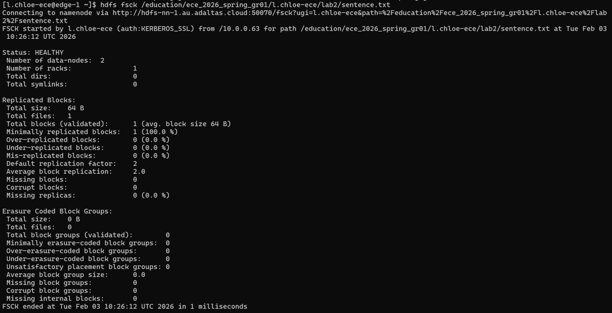
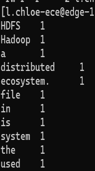

# Lab 2 : Prise en main du cluster Hadoop (HDFS, YARN, Kerberos)

**Objectif** : prendre en main un cluster Hadoop multi-nœuds sécurisé : stockage distribué avec HDFS, exécution de jobs avec YARN, et accès aux interfaces web authentifiées par Kerberos.

📄 [Rapport avec captures (PDF)](rapport_lab2.pdf) · 🧾 [Commandes (`commandes.sh`)](commandes.sh)

| Étape | Ce que j'ai fait | Ce que ça montre |
|---|---|---|
| **HDFS** | Création de mon espace dans le namespace du groupe, dépôt d'un fichier, puis `hdfs fsck` | Découpage en blocs, **facteur de réplication 2**, répartition sur 2 DataNodes, état `HEALTHY` |
| **YARN** | Soumission du job d'exemple `pi` (méthode quasi-Monte Carlo), puis `yarn app -list` | Cycle de vie d'une application YARN (`ACCEPTED` → `RUNNING` → `FINISHED` / `SUCCEEDED`) |
| **WordCount** | Exécution du WordCount MapReduce sur les fichiers HDFS du lab | Sortie `part-r-00000` produite par les reducers : un mot et son nombre d'occurrences par ligne |
| **SSH sans mot de passe** | Génération d'une clé RSA 4096 bits et `ssh-copy-id` vers le nœud edge | Authentification par clé |
| **Kerberos** | Configuration de `krb5.ini`, obtention d'un ticket (MIT Kerberos) et configuration de Firefox (SPNEGO) | Accès sécurisé à l'interface du ResourceManager YARN |
| **Analyse YARN** | Trois exécutions du même job `pi` : 31 s, 9 s puis 19 s | Le temps d'exécution dépend de la charge du cluster au moment de la soumission : l'**ordonnancement de YARN est dynamique** |

Captures

**`hdfs fsck` : blocs et réplication**

**Résultat du WordCount**

## 💡 À retenir

- HDFS sépare les **métadonnées** (NameNode) des **données** (DataNodes). Chaque bloc est répliqué pour tolérer les pannes.
- YARN sépare la **gestion des ressources** (ResourceManager) de l'**exécution** (un ApplicationMaster par job).
- Sur un cluster sécurisé, chaque accès, en ligne de commande comme dans le navigateur, passe par un ticket **Kerberos**.
