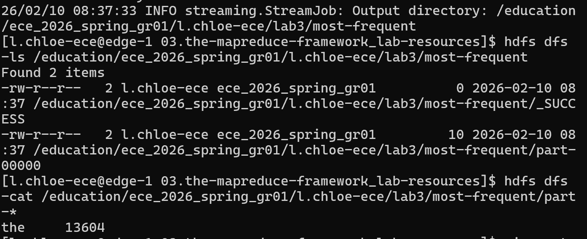

# Lab 3 : MapReduce avec Hadoop Streaming (Python)

**Objectif** : trouver le **mot le plus fréquent** d'un corpus (*Moby Dick*) en enchaînant un second job MapReduce, écrit en Python, sur la sortie du job `word_count`.

📄 [Rapport détaillé (PDF)](rapport_lab3.pdf)

## ⚙️ Principe

```
word_count (job 1)          most_frequent (job 2)
"the\t13604"   ──mapper──►  ("MAX", "13604\tthe")   ──shuffle──►  reducer : garde le max  ──►  "the\t13604"
"whale\t…"     ──mapper──►  ("MAX", "…\twhale")
```

- **Mapper** ([`mapper.py`](most_frequent/mapper.py)) : il lit chaque ligne `mot<TAB>nombre` et émet une **clé constante `MAX`**. Toutes les paires arrivent ainsi dans le même reducer. Les lignes mal formées sont ignorées.
- **Reducer** ([`reducer.py`](most_frequent/reducer.py)) : il parcourt les valeurs et garde celle qui a le plus grand compteur. En cas d'égalité, il départage par ordre alphabétique pour que le résultat soit **déterministe**.
- **Lancement** : [`run_most_frequent.sh`](run_most_frequent.sh) (via `mapred streaming`).

## ▶️ Tester sans cluster

Hadoop Streaming ne fait que relier stdin et stdout. On peut donc simuler « map → tri → reduce » avec des pipes Unix :

```bash
./test_local.sh
# the	13604
```

## 📊 Résultat

Le mot le plus fréquent est **« the »**, avec **13 604** occurrences. Le job s'est terminé avec succès (`_SUCCESS`).



## 💡 À retenir

- Hadoop Streaming permet d'écrire des jobs MapReduce dans **n'importe quel langage** qui lit stdin et écrit sur stdout.
- Une clé constante envoie tout vers **un seul reducer**. C'est simple pour un maximum global, mais cela ne passe pas à l'échelle sur de très gros volumes. Une amélioration serait de calculer un maximum local dans chaque mapper (ou un *combiner*) avant la réduction finale.
- On peut enchaîner plusieurs jobs, la sortie de l'un servant d'entrée au suivant. C'est exactement ce qu'on automatise ensuite avec un orchestrateur comme Oozie.
