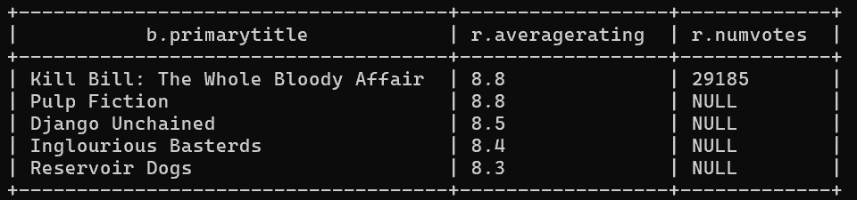

# Lab 4.2 : Hive Query Language (jeu de données IMDb)

**Objectif** : interroger avec HiveQL un entrepôt de données Hive construit à partir des tables IMDb (`title_basics`, `title_ratings`, `title_crew`, `name_basics`), en utilisant des filtres, des expressions régulières, des types complexes (tableaux) et des jointures multiples.

📄 [Rapport avec captures (PDF)](rapport_lab4.2.pdf) · 🧾 [Requêtes (`requetes.hql`)](requetes.hql)

| # | Question | Technique | Résultat |
|---|---|---|---|
| 1 | Nombre de titres de plus de 2 h | filtre simple | **151 676** |
| 2 | Durée moyenne des titres contenant le mot entier « world » | `RLIKE` avec délimiteurs de mot (« World War Z » oui, « Underworld » non) | **25,6 min** |
| 3 | Note moyenne des comédies | `JOIN` + `array_contains` sur la colonne `genres` (tableau) | **6,89** |
| 4 | Note moyenne hors comédies | `NOT array_contains` | **6,97** |
| 5 | Top 5 des films de Quentin Tarantino | jointure sur **4 tables** + tri sur la note puis le nombre de votes | Kill Bill (8,8), Pulp Fiction (8,8), Django Unchained (8,5)… |

## 💡 À retenir

- Les colonnes multi-valuées (genres, réalisateurs) sont des **tableaux** Hive : on utilise `array_contains`, et non une égalité ou un `LIKE`.
- Une expression régulière avec des délimiteurs `(^|[^A-Za-z])…([^A-Za-z]|$)` évite les faux positifs quand on cherche un mot entier.
- Pour une requête complexe, on procède **par étapes** : on récupère d'abord l'identifiant (`nconst`), puis on l'utilise dans la jointure finale.
