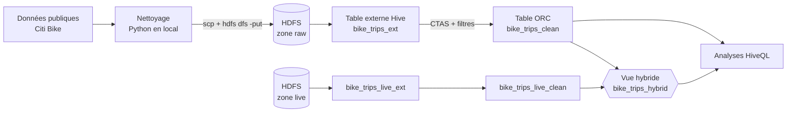
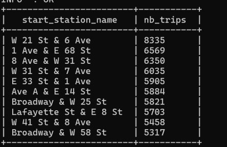
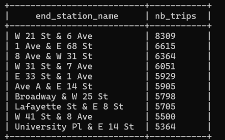
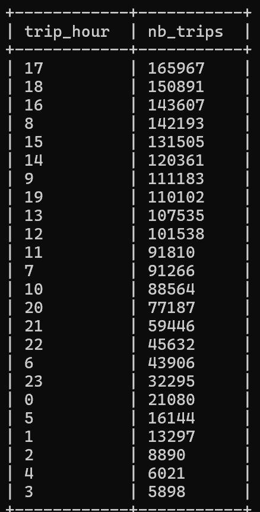
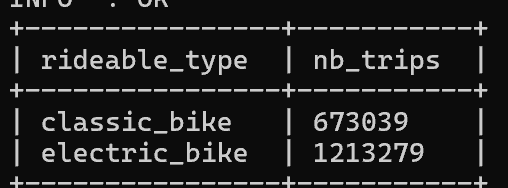
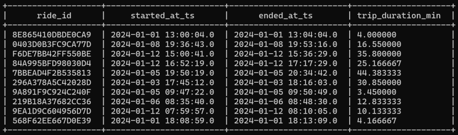
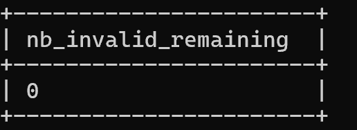
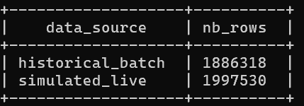

# 🚲 Pipeline Big Data : analyse des trajets Citi Bike à New York

Projet réalisé en binôme avec **Edouard Menut** dans le cadre du cours *Big Data Ecosystem* (ECE Paris).

**Problématique** : comment collecter, stocker, structurer et analyser l'historique des trajets d'un réseau de vélos en libre-service, pour mieux répartir les vélos entre les stations et dimensionner le service ?

📄 [Rapport complet (PDF)](rapport_projet.pdf)


## 🏗️ Architecture

Il s'agit d'un pipeline **batch** sur un cluster Hadoop, prolongé en bonus par une **architecture hybride** qui simule l'arrivée de nouvelles données.



| Couche | Rôle |
|---|---|
| **Nettoyage local (Python)** | Fusion de deux extractions Citi Bike, suppression des lignes vides, des dates invalides, des durées négatives ou supérieures à 24 h, et des doublons |
| **HDFS (raw)** | Stockage distribué et persistant du fichier brut (environ 320 Mo) |
| **Table externe Hive** | Accès SQL au CSV sans le déplacer : les dates restent en `STRING` pour coller fidèlement au fichier source |
| **Table `clean` (ORC)** | Conversion des horodatages, calcul de la durée en minutes, filtrage. Le format colonne ORC accélère les agrégations |
| **YARN** | Allocation des ressources du cluster pour l'exécution des requêtes Hive |
| **Vue hybride** | `UNION ALL` entre l'historique et les nouvelles données, avec une colonne `data_source` pour garder la traçabilité |

## 📂 Scripts

| Fichier | Étape |
|---|---|
| [`sql/01_ingestion_hdfs.sh`](sql/01_ingestion_hdfs.sh) | Création de la zone brute et dépôt du CSV dans HDFS |
| [`sql/02_table_externe.hql`](sql/02_table_externe.hql) | Table externe sur le CSV (OpenCSVSerde) |
| [`sql/03_table_clean.hql`](sql/03_table_clean.hql) | Table analytique ORC et contrôles qualité |
| [`sql/04_analyses.hql`](sql/04_analyses.hql) | Requêtes métier : stations, heures de pointe, durée, type de vélo |
| [`sql/05_bonus_hybride.hql`](sql/05_bonus_hybride.hql) | Ingestion des nouvelles données et vue hybride |

```bash
beeline -u "<jdbc-url>" --hivevar db=<base> --hivevar raw_path=<chemin_hdfs>/raw -f sql/02_table_externe.hql
```

## 📊 Résultats clés

**1 886 318 trajets** analysés (historique), puis **3 883 848** au total avec les données simulées.

| Indicateur | Résultat | Lecture métier |
|---|---|---|
| Station la plus utilisée | **W 21 St & 6 Ave** (8 335 départs, 8 309 arrivées) | 9 des 10 stations les plus utilisées au départ le sont aussi à l'arrivée : les usagers rééquilibrent en partie le réseau eux-mêmes |
| Point d'attention | **Broadway & W 58 St** | Présente dans le top des départs mais pas des arrivées : risque de pénurie, réapprovisionnement à prévoir |
| Heures de pointe | **8 h – 9 h** et **16 h – 18 h** (pic à 17 h : 165 967 trajets) | Usage majoritairement domicile-travail |
| Durée moyenne | **≈ 11 minutes** | Trajets courts et urbains |
| Type de vélo | **64 % électriques** (1 213 279 contre 673 039 classiques) | Augmenter la part de vélos électriques dans les stations les plus sollicitées |

<details>
<summary>Voir les captures des résultats</summary>

| Top stations de départ | Top stations d'arrivée |
|---|---|
|  |  |

| Heures de pointe | Types de vélo |
|---|---|
|  |  |

**Aperçu de la table nettoyée**


**Contrôle qualité et vue hybride**

 
</details>

## ✅ Tests et validation

La validation a été faite à chaque étape du pipeline :

- **Stockage** : présence et lisibilité du fichier dans HDFS (`hdfs dfs -ls`, `-du -h`, `-cat | head`).
- **Ingestion** : schéma de la table externe (`DESCRIBE`) et en-tête bien ignoré.
- **Transformation** : même nombre de lignes avant et après nettoyage (1 886 318), ce qui est attendu puisque les données étaient déjà pré-nettoyées. Il reste **0 enregistrement invalide** (valeurs nulles ou durée ≤ 0).
- **Vue hybride** : 1 886 318 lignes historiques + 1 997 530 lignes simulées = 3 883 848 lignes, avec l'origine de chaque ligne conservée.

## 🔭 Pistes d'amélioration

- Orchestrer les étapes avec **Oozie** ou **Airflow**, pour que le pipeline s'exécute automatiquement dès l'arrivée d'un nouveau fichier.
- **Partitionner** la table `clean` par date, pour que les requêtes ne lisent que les jours nécessaires.
- Remplacer la simulation « live » par un vrai flux **Kafka** + **Spark Structured Streaming**.

## 📦 Données

Le jeu de données provient des [données publiques Citi Bike](https://citibikenyc.com/system-data) (New York). Les fichiers CSV (environ 320 Mo) ne sont pas versionnés dans ce dépôt en raison de leur taille.
